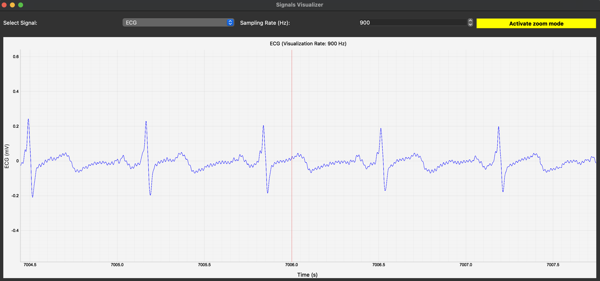
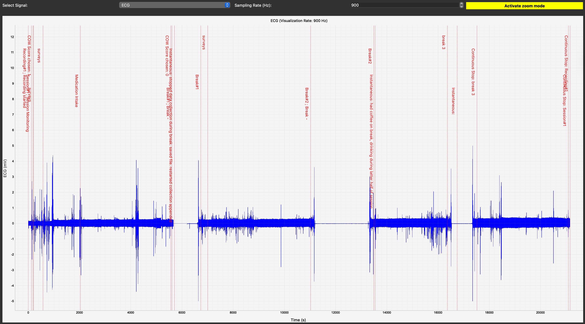

# **Biopac signal visualizer**
A **PyQt5 + PyQtGraph-based GUI application** for visualizing physiological time-series signals (ECG, PPG, EDA, Skin temperature) from a label merged CSV file. It supports real-time downsampling, interactive pan/zoom, along with labeled event annotations.

---

## **Features**
1.  Load a merged CSV file with multiple biosignals  
2.  Interactive signal selection (ECG, PPG, EDA, SKT)  
3.  Adjustable sampling rate (downsampling/upsampling) 
4.  Pan/Zoom toggle mode with double-click to reset  
5.  Event label visualization with vertical lines and text annotations  
6.  Toast popups for quick notifications (e.g., when mode changes)  

---

## **Preview**

---

## **Requirements**

- Python 3.8 or later  
- The following Python libraries:

pandas>=2.0.0
numpy>=1.24.0
PyQt5>=5.15.0
pyqtgraph>=0.13.1

## **Installation** 
1. To clone or download this repository.
git clone https://github.com/paudel54/biopac-signal-visualizer
2. Change directory
cd biopac-signal-visualizer
3. Install dependencies: 
pip install -r requirements.txt
4. Run the script: 
python visualize.py

# biopac-signal-visualizer
